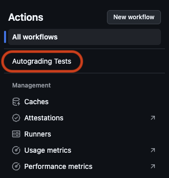
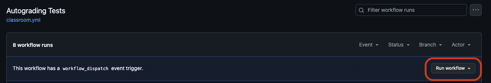

# html-lists
Welcome to your first GitHub Classroom assignment! In this exercise, you'll create a boilerplate HTML5 page, practice using headings, unordered lists, and description lists to create a simple resume page using valid HTML5.

# HTML Lists Assignment
Create a boilerplate html5 page.

## meta data
Enter your name as the title.
## body 
Create the following html elements in the body `<body>` in this order.  The content for each tag is listed in italics:
- level 1 heading `<h1>` - *your name*
- level 3 heading `<h3>`- *skills*
- unordered list - *at least 3 skills you have*
- level 3 heading `<h3>` - *experience*
- description list - *date range in term*, *experience in description*

## Run tests locally as much as possible (only use Github Action for limited testing and final submission)
You can run the tests locally by running `npm install`, then `npm test` in the terminal. Go to [Node.js home page](https://nodejs.org/en/download/) for more information on installing npm and Node.js

## Submit your assignment
1. Push your code to the remote repository on GitHub.
2. Got to Action tab in your repository.

3. Select the workflow named "Autograding Tests" from the list of workflows.  

4. Click on the "Run workflow" button to run the tests.
