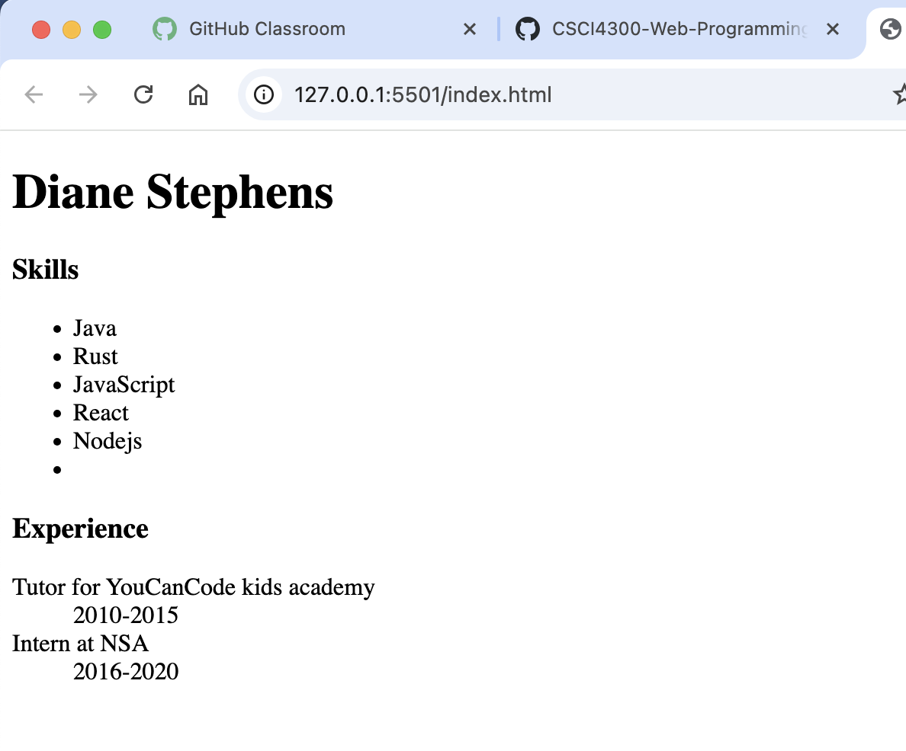

# html-lists
Welcome to your first GitHub Classroom assignment! In this exercise, you'll create a boilerplate HTML5 page, practice using headings, unordered lists, and description lists to create a simple resume page using valid HTML5.

# HTML Lists Assignment
Create a boilerplate html5 page.

## meta data
Enter your name as the title.
## body 
Create the following html elements in the body `<body>` in this order.  The content for each tag is listed in italics:
- level 1 heading `<h1>` - *your name*
- level 3 heading `<h3>`- *skills*
- unordered list - *at least 3 skills you have*
- level 3 heading `<h3>` - *experience*
- description list - *date range in term*, *experience in description*

  ### Sample browser screenshot:


Welcome to your first HTML assignment! In this exercise, you'll practice using headings, unordered lists, and description lists to create a simple resume page using valid HTML5.

---

## 🎯 Learning Objectives

By the end of this assignment, you will be able to:

- Write valid HTML5 boilerplate.
- Use appropriate heading levels to structure content.
- Create unordered and description lists to organize data.
- Apply semantic HTML for accessibility and clarity.
- Validate and test your HTML for correctness.

---

## 📝 Task Description

Create an `index.html` file that includes a **title**, a top-level heading, and **two sections**:

1. **Skills**  
   - Use a heading (`<h3>`) labeled "Skills".
   - Use an **unordered list (`<ul>`)** to list at least 5 technical skills (e.g., JavaScript, React, Git).

2. **Experience**  
   - Use a heading (`<h3>`) labeled "Experience".
   - Use a **description list (`<dl>`)** to list at least 2 positions or experiences:
     - Each position should include a `<dt>` for the job title.
     - Each description should use a `<dd>` with the dates or role description.

Here is a simple example:

```html
<!DOCTYPE html>
<html lang="en">
<head>
  <meta charset="UTF-8" />
  <meta name="viewport" content="width=device-width, initial-scale=1.0"/>
  <title>Diane Stephens</title>
</head>
<body>
  <h1>Diane Stephens</h1>

  <h3>Skills</h3>
  <ul>
    <li>JavaScript</li>
    <li>HTML</li>
    <li>CSS</li>
    <li>React</li>
    <li>Git</li>
  </ul>

  <h3>Experience</h3>
  <dl>
    <dt>Software Intern at ExampleCorp</dt><dd>Summer 2023</dd>
    <dt>Teaching Assistant for CS1301</dt><dd>Fall 2022 – Spring 2023</dd>
  </dl>
</body>
</html>

## In a browser:
